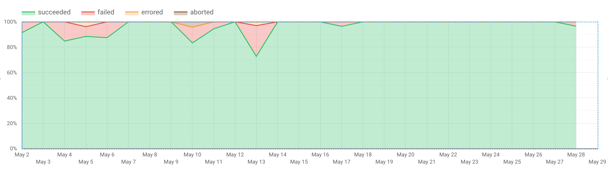
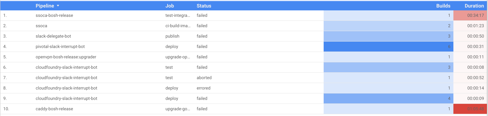

# google-datastudio-connector-concourse-builds

An experiment to provide [Concourse](https://concourse-ci.org/) build data for [Google Data Studio](https://datastudio.google.com/) reports and dashboards.

Worked out, although data retrieval was relatively slow. Next iteration I'd probably focus on writing an exporter to BigTable with the same data since historical data does not change.

## Screenshots

A graph showing distribution of job statuses over time...

A table of failed jobs and their frequency, duration...

## License

[MIT License](LICENSE)
